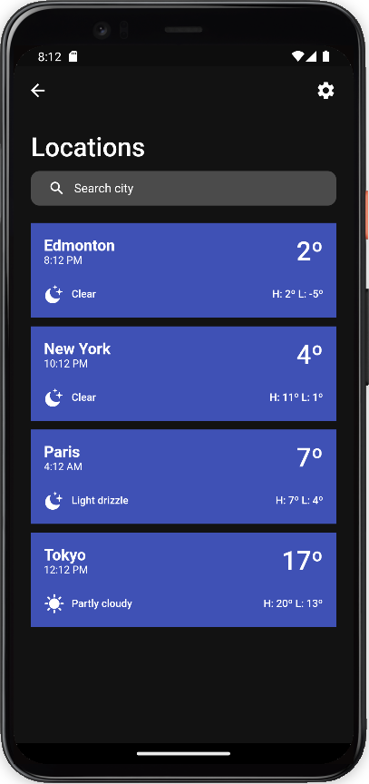

<br />
<p align="center">
  <a href="https://github.com/ugiete/WeatherApp">
    
  </a>

  <h3 align="center">Weather App</h3>

  <p align="center">
    A Flutter mobile app for weather forecasting
    <br />
    <a href="https://github.com/ugiete/WeatherApp/issues">Report Bug</a>
    ·
    <a href="https://github.com/ugiete/WeatherApp/issues">Request Feature</a>
  </p>
</p>

<details open="open">
  <summary>Table of Contents</summary>
  <ol>
    <li><a href="#about-the-project">About The Project</a></li>
    <li><a href="#getting-started">Getting Started</a></li>
    <li><a href="#usage">Usage</a></li>
    <li><a href="#screenshots">Screenshots</a></li>
    <li><a href="#roadmap">Roadmap</a></li>
    <li><a href="#contributing">Contributing</a></li>
    <li><a href="#license">License</a></li>
    <li><a href="#contact">Contact</a></li>
    <li><a href="#acknowledgements">Acknowledgements</a></li>
  </ol>
</details>

## About The Project

This is a Flutter mobile project proposed by [HeyFlutter.com](https://heyflutter.com/) using [weather API](https://www.weatherapi.com/).

This project has two main goals: For me is an opportunity to show my skills building a simple Flutter mobile application, and for the general public to have an entrypoint to start learning Flutter and how to integrate with APIs. With this project, one could edit and publish their own version.

### Built With

* [Flutter](https://flutter.dev/)

## Getting Started

The usage will describe and contains screenshots of Android Emulators. Similiar processes to test on real devices or iOS emulators.

### Prerequistes

This is a Flutter app, so you need it installed, we also need access to the weather API.

To build and compile this app you must have either Android Studio or XCode (for iOS).

## Usage

To run on emulator:

  * Start your Android Virtual Device
  * Install dependencies with `flutter pub get` inside the project
  * Start the app on debug mode with `flutter run`

Now you can check your Android device.

#### Notes

* The app relies on SQLite and Secure storage to persist data
* To clear all data persisted, uninstall your app
* To use your own Weather API Key, edit the file `lib/services/weather_api.dart`
* Once you define a favorite location the app will always open on this location, if no default location is set the app will open on the list of all locations

```dart
// imports

const String kAPIKey = 'WEATHER_API_KEY';

// ...
```

## Screenshots

#### Locations Page

At this page one can check the list of saved locations at the app and edit preferences (ºC or ºF).





#### Search Page

At this page you can search for new locations or use your current location (on virtual devices this could show fake coordinates).


#### Details Page

At this page you'll find a more detailed version of the weather and forecast for the next 3 days'.

##### Notes

* The current API on free tier doesn't support Sunrise/Sunset and Dew point information


#### Map Page

At this page you can navigate on the globe to find new locations. Tap to add this coordinate into the list of saved locations.


## Roadmap

See the [open issues](https://github.com/othneildrew/Best-README-Template/issues) for a list of proposed features (and known issues).

## Contributing

Contributions are what make the open source community such an amazing place to be learn, inspire, and create. Any contributions you make are **greatly appreciated**.

1. Fork the Project
2. Create your Feature Branch (`git checkout -b feature/AmazingFeature`)
3. Commit your Changes (`git commit -m 'Add some AmazingFeature'`)
4. Push to the Branch (`git push origin feature/AmazingFeature`)
5. Open a Pull Request

## License

Distributed under the MIT License. See `LICENSE` for more information.

## Contact

Feel free to send messages, suggestions, etc. I would love to talk about Flutter, Elixir, Phoenix, Backend and Mobile development, Cloud, IoT and especially soccer :)


[`Leonardo Silva Ugiete`](www.linkedin.com/in/ugiete) - leonardougiete@hotmail.com

Project Link: [Weather App](https://github.com/ugiete/WeatherApp)

## Acknowledgements
* [HeyFlutter.com](https://heyflutter.com/)